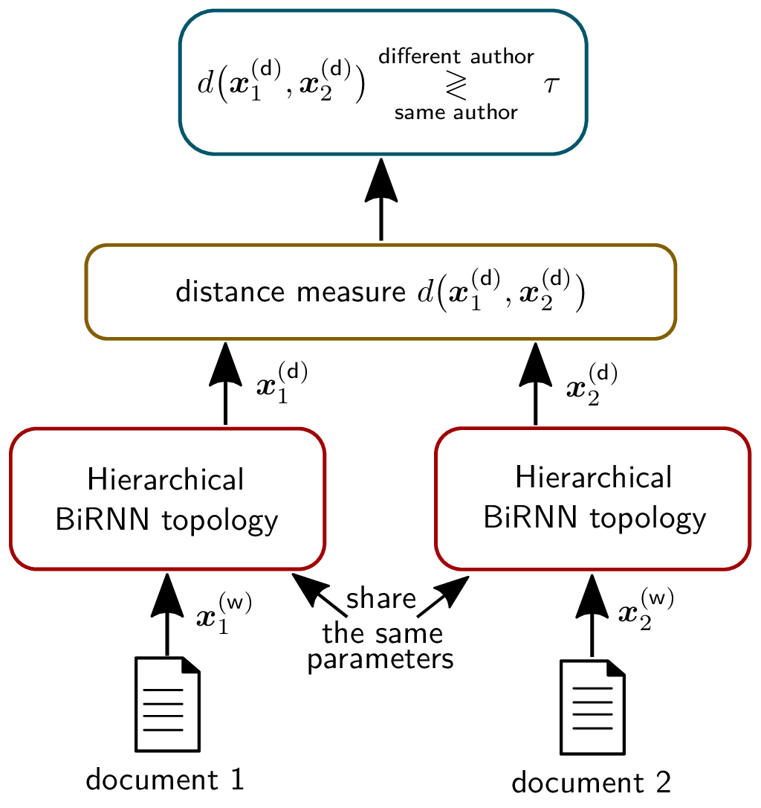

# Similarity Learning for Authorship Verification in Social Media

Authorship verification tries to answer the question if two documents with unknown authors were written by the same author or not. A range of successful technical approaches has been proposed for this task, many of which are based on traditional linguistic features such as n-grams. These algorithms achieve good results for certain types of written documents like books and novels. Forensic authorship verification for social media, however, is a much more challenging task since messages tend to be relatively short, with a large variety of different genres and topics. At this point, traditional methods based on features like n-grams have had limited success. In this work, we propose a new neural network topology for similarity learning that significantly improves the performance on the author verification task with such challenging data sets. 

This repository contains the source code used in our paper [_Similarity Learning for Authorship Verification in Social Media_](https://arxiv.org/abs/1908.07844) published in [_ICASSP 2019 - 2019 IEEE International Conference on Acoustics, Speech and Signal Processing (ICASSP)_](https://ieeexplore.ieee.org/document/8683405)

Please, feel free to send any comments or suggestions! (benedikt.boenninghoff[at]rub.de)

# Installation

We used Python 3.6 (Anaconda 3.6). The following libraries are required:

* Tensorflow 1.12. - 1.15
* spacy 2.3.2 (download tokenizer via "python -m spacy download en_core_web_lg")
* textacy 0.8.0
* fasttext 0.9.2
* numpy 1.18.1
* scipy 1.4.1
* pandas 1.0.4
* scikit-learn 0.20.3
* bs4 0.0.1

# Dataset

This repository works with a [_small Amazon review dataset_](https://github.com/marjanhs/prnn), including 9000 review pairs written by 300 distinct authors. Since you can achieve 99% accuracy, this dataset provides a simple sanity check for new authorship verification methods.

    mkdir data
    cd data
    wget https://github.com/marjanhs/prnn/raw/master/data/amazon.7z
    sudo apt-get install p7zip-full
    7z x amazon.7z

# Download pretrained word embeddings

We used [_pretrained word embeddings_](https://fasttext.cc/). You may prepare them as follows:
    
    cd data
    wget https://dl.fbaipublicfiles.com/fasttext/vectors-crawl/cc.en.300.bin.gz
    gunzip cc.en.300.bin.gz

# Data preprocessing
    
    python main_preprocess.py

# Training
You can train the model as follows:
    
    python main_hrsn.py

Using the evaluation script of the [_PAN 2020 AV challenge_](https://pan.webis.de/clef20/pan20-web/author-identification.html), the results may look like this:

| AUC   |  c@1  | f_0.5_u |  F1    | overall |
|:-----:|:-----:|:-------:|:------:|:-------:|
| 0.997 | 0.993 | 0.991   | 0.993  |  0.994  |

# Cite the paper

If you use our code or data, please cite the papers using the following BibTeX entries:

    @inproceedings{Boenninghoff2019a,
    author={Benedikt Boenninghoff, Robert M. Nickel, Steffen Zeiler and Dorothea Kolossa},
    booktitle={IEEE International Conference on Acoustics, Speech and Signal Processing (ICASSP 2019), Brighton, UK, May 12-17, 2019},
    title={Similarity Learning for Authorship Verification in Social Media},
    year={2019},
    pages={2457-2461},
    doi={10.1109/ICASSP.2019.8683405},
    }

